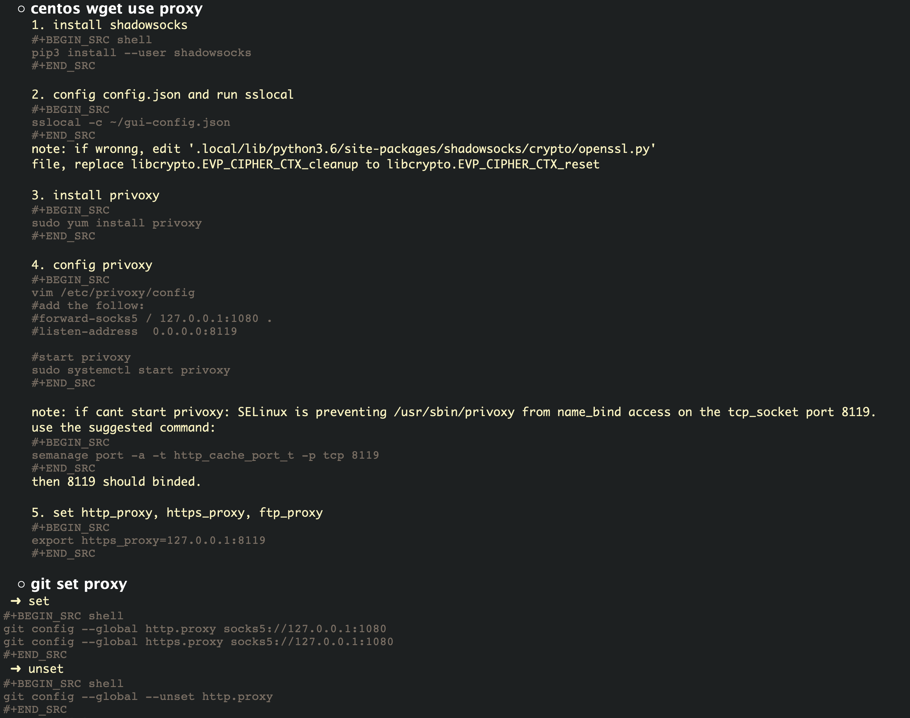

# proxy 配置

### 浏览器设置插件走socks5协议
* motivation
    * 最近很多ipv4的代理服务器都被封禁了，只能使用ipv6的代理服务器。
    * 但是学校更新了VPN工具，使用atrust，会导致电脑无法获取ipv6网址，这就导致暑假在家无法兼得校园网服务器和Google
* 解决方法：
    * 在实验室小工作站上配置了socks5协议的代理，通过校园内的socks5协议，转发访问ipv6的代理服务器。
    * 在个人PC机浏览器（Edge）内，添加SwitchyOmega插件，配置socks5协议代理去访问实验室小工作站。

```bash
# install shadowsocks
pip3 install shadowsocks

# create the config file
cd /etc/ && mkdir shadowsocks && cd shadowsocks && touch config.json

# copy the config.json content

# start the shadowsocks
sslocal -d start -c /etc/shadowsocks/config.json

# it may be errors: reset
# to modify the source code: /usr/local/lib/python3.6/site-packages/shadowsocks/crypto/openssl.py
# it depends on the different version of python (python3.6 or python3.8, etc.)

#change the next two lines (change the cleanup into reset)
#libcrypto.EVP_CIPHER_CTX_cleanup.argtypes = (c_void_p,)
libcrypto.EVP_CIPHER_CTX_reset.argtypes = (c_void_p,)
#libcrypto.EVP_CIPHER_CTX_cleanup(self._ctx)
libcrypto.EVP_CIPHER_CTX_reset(self._ctx)

# in your users set the http configures.
git config --global http.proxy socks5://127.0.0.1:1080
```

## wget 设置socks5 协议代理
* motivation
    * 现有的代理服务器是ipv6的代理服务器，走的是socks5协议代理。
    * 经过下边的错误尝试之后知道，wget 的 https_proxy 不支持socks5协议代理。
* 测试方法：
    * `wget www.google.com` 能够成功下载 index.html 即为成功代理。
* 错误尝试
    * 使用tsocks工具，目前搜索到，只能在Ubuntu上较为简单的安装tsocks，在centos上安装较为费劲。
        * 安装成功之后，进行相应的配置，依旧无法进行代理。参照的是 [linux shell socks5 proxy](https://blog.csdn.net/zhuogoulu4520/article/details/103178539)
        * 也有人佐证，配置之后无法使用，参照：[socks5 proxy and wget](https://www.mufljuz.com/?p=11)。
    * 在askubuntu上看到了有人提问wget无法配置socks5协议代理，有人回复wget就是不支持socks5，建议使用curl, 参照：[can you set socks5 proxy from Linux command line](https://askubuntu.com/questions/1327783/can-you-set-socks5-proxy-from-linux-command-line)。
    其他地方也有佐证curl相对于wget来讲支持socks协议， 参照：[How to Use Wget With Proxy](https://oxylabs.io/blog/wget-proxy)。
* 正确解决方法：使用privoxy作为vps6 shadowsocks 代理和wget之间的代理。具体实现见下边shell代码：

```bash
#1. install shadowsocks
pip3 install --user shadowsocks

#2. config config.json and run sslocal
sslocal -c ~/gui-config.json
#note: if wrong, edit '.local/lib/python3.6/site-packages/shadowsocks/crypto/openssl.py' file, replace libcrypto.EVP_CIPHER_CTX_cleanup to libcrypto.EVP_CIPHER_CTX_reset

###################### 前边两步是配置shadowsocks, 具体见上边的步骤#######################
#3. install provoxy
sudo yum install privoxy

#4. config privoxy
sudo vim /etc/privoxy/config
#add the follows:
fowrard-socks5 / 127.0.0.1:1080 .
listen-address 0.0.0.0.8118

#5. start privoxy
sudo systemctl start privoxy
#note: if cannot staet privoxy, SELinux is preventing /usr/sbin/privoxy from name_bind access on the tcp_socket port 8119. Use the suggested command:
semanage port -a -t http_cache_port_t -p tcp 8119
#then 8119 should binded.

#6. set http_proxy, https_proxy, ftp_proxy
export https_proxy=127.0.0.1:8119

#7. git set proxy
git config --global http.proxy socks5://127.0.0.1:1080
git config --global https.proxy socks5://127.0.0.1:1080
# unset
git config --global --unset http.proxy

# cat .wgetrc
use_proxy=on
https_proxy=127.0.0.1:8118
http_proxy=127.0.0.1:8118

```
参照图片（以防有拼写错误）：

* 挂代理效果：
    * 使用代理下载`wget https://ftp.sra.ebi.ac.uk/vol1/fastq/SRR145/025/SRR14575325/SRR14575325.fastq.gz`, 673KB/s.
    * 不使用代理：`wget --no-proxy  https://ftp.sra.ebi.ac.uk/vol1/fastq/SRR145/025/SRR14575325/SRR14575325.fastq.gz`, 249KB/s.