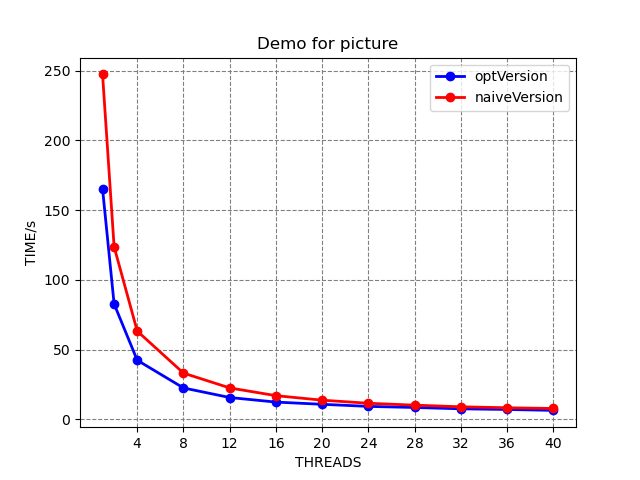

## python

## 画图
在之前都是使用`Office Excel`画折线图，了解使用了`python matplotlib`之后，发现还是自动生成工具好用。有人说latex相对word来讲入门难，但是用久了简单，python相对于excel在画图方面也是差不多，而且excel也不简单，反正都是需要百度，然后套公式。

```python
import matplotlib.pyplot as plt
fig = plt.figure()
x = (1, 2, 4, 8, 12, 16, 20, 24, 28, 32, 36, 40)
x_grid = (4, 8, 12, 16, 20, 24, 28, 32, 36, 40)
y1 = (165.381, 82.775, 42.407, 22.538, 15.67, 12.392, 10.807, 9.305, 8.528, 7.567, 7.101 ,6.433)
y2=(247.402, 123.804, 63.297, 33.173, 22.556, 17, 13.764, 11.548, 10.185, 9.015, 8.319, 7.812)
ax = fig.add_subplot(111)
ax.plot(x, y1, '-', lw=2, color= 'blue',marker='o',markerfacecolor = 'blue',label='optVersion')
ax.plot(x, y2, '-', lw=2, color= 'red',marker='o',markerfacecolor = 'red',label='naiveVersion')
ax.axes.set_xticks(x_grid)
plt.title('Demo for picture')
plt.xlabel("THREADS")
plt.ylabel("TIME/s")
plt.grid(axis='both')
plt.grid(color='gray')
plt.grid(linestyle='--')
plt.legend()
plt.show()
```
以上代码的运行结果如图所示：

并且在运行结果中还可以调节图的上下高度，左右宽度，对于某一部分的放大，可以直接将结果另存为`.png`图片类型或者`.pdf`类型,非常好用.